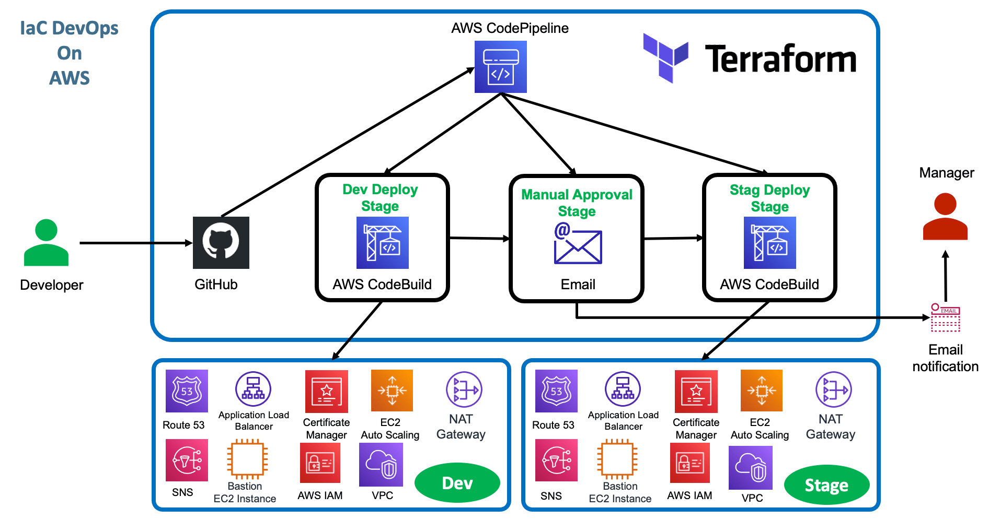
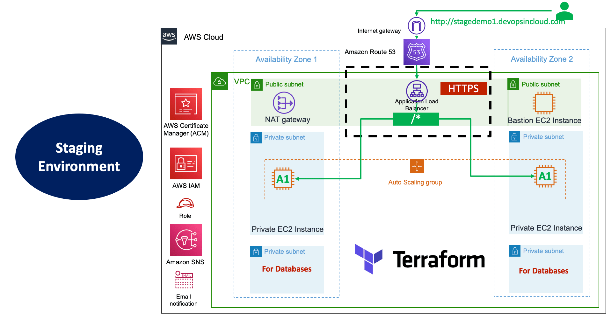

# Introduction

### 1. Infrastructure is defined in Terraform code and is being deployed to AWS with GitHub Actions.
### 2. Infrastructure

- VPC (Multi-AZ)
- IAM
- Security Groups
    - Bastion Host
    - Private
    - Load Balancer
- EC2 Instances
    - Single EC2 Instance for Bastion Host
    - Other instances managed with AutoScaling Group and Launch Template
- Application Load Balancer
    - Fixed response
    - Host-based routing based on path pattern
    - HTTPS redirection
- ACM TLS Certificate
- Route53 DNS Registration
- AutoScaling
    - Target Tracking (AVG CPU Load, AVG LB Connections to single target)
    - Scheduled
    - SNS Email Notification will be sent out for any autoscaling events
- Backend for Remote State Storage
- DynamoDB State Lock - Optional - Not required as only single instance of pipeline can run at a given time

### 3. Multiple environments managed by their respective configuration files.

- Terraform-defined infrastructure is being deployed using GitHub Actions. 
- Environment promotion (DEV > STAG > PROD) is defined in GitHub Actions. Manual approval required for promoting to PROD.

# Architecture

# Configuration / Use

| Variable          | File          | Comment                     |
| ----------------- | ------------- | --------------------------- |
| `dns_name`        | env_\*.tfvars |                             |
| `environment`     | env_\*.tfvars |                             |
| `bucket` `key` | env_\*.conf   | Backend config for .tfstate |
| `region`          | env_\*.conf   |                             |

Set the `TF_COMMAND` in `./.github/workflows/02-terraform-deploy.yml` accordingly (to DEPLOY or DESTROY).

# Test the application

Check `dns_name` in `env_\*.tfvars` file, copy the URi and test the application.

**DEV:** https://dev.aws.skynetx.uk

**STAG:** https://stag.aws.skynetx.uk

**PROD:** https://www.aws.skynetx.uk

# Cleanup

**After** the infrastructure have been **destroyed**:

- folder that keeps terraform state files can be deleted (check `key` variable in `terraform-manifests\env_*.conf`)

# Dependencies

| Repository        | Terraform           | Comment                     |
| ----------------- | -------------       | --------------------------- |
| `terraform-core`  | `aws-backends`      |  S3 Bucket must be present for Terraform S3 backends to work (as configured in `env_\*.conf`, see above).                           |

# Building new region

- Add region-specifig Terraform configurations:
    - `terraform-manifests\env_NEWENVIRONMENT.conf`
    - `terraform-manifests\env_NEWENVIRONMENT.tfvars`
- Update GitHub Actions
    - Define OICD permissions for the new environment to be accessible by GitHub Actions (`terraform-core\aws-oidc\c4-iam-gh1.tf`)
    - Define new environment in GitHub Actions (`.github/workflows/02-4-deploy-env-promotion.yml`)

# TODO

- Storing and distributing EC2 private key in AWS SSM (assessment required)

    SSH key is not being copied to the Bastion Host. It would have to be copied manually if connecting to the private app servers was required.

- Load Balancer connections policy throws an error when running first time

`"aws_autoscaling_policy" "alb_target_requests_greater_than_yy"` in `c13-06-autoscaling-ttsp.tf` needs to be corrected (wait?). It is throwing routing errors when deployed first time. It is ok on the second run.